# CI/CD 자료 정리

## 1. 이해
CI/CD 구성을 위한 사전 지식  

### 1.1. What is a Multi-branch Pipeline?  
멀티 브랜치 파이프라인은 소스 저장소의 Branch(PR)를 기반으로 Jenkins 파이프라인을 자동으로 생성하는 개념입니다. 
소스 저장소(Github)에서 새 브랜치를 자동으로 검색하고 해당 브랜치에 대한 파이프라인을 자동으로 생성할 수 있습니다. 
젠킨스는 각 브랜치의 Jenkinsfile을 빌드 단계에 사용합니다.

브랜치 별 파이프라인 동작을 설정하기 위해 Jenkinsfile에 조건부 논리를 추가할 수 있습니다.
예를 들어 개발자가 작업하는 브랜치에서 단위 테스트 및 정적 분석만 실행하도록 하려면 아래와 같이 when 조건으로 건너뛰는 조건을 가질 수 있습니다.
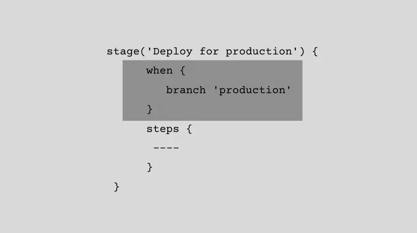  

### 1.2. Github flow 전략
소스 저장소의 관리(개발) 전략에 따라 젠킨스의 구성이 달라질 수 있다. 
이 문서에서는 GitHub Flow를 추천하며 GitHub Flow에 대해서 설명한다.  
( 브랜치 이름 : Master == Main )
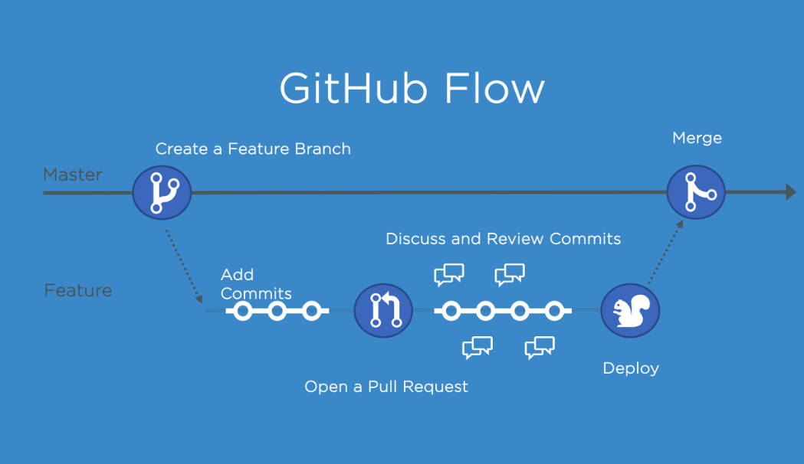  
* Git Flow도 좋은 방식이지만 복잡하다는 Scott Chacon의 판단에 따라 만들어진 새로운 관리 방식  
* Git Flow에 비해 흐름이 단순해짐에 따라 그 규칙도 단순  
* Main Branch에 대한 규칙만 정확하게 정립되어 있다면 나머지 Branch에 대해서는 특별한 관여를 하지 않으며
  Pull Request 기능을 사용하도록 권장  

#### **특징**  
* Release Branch가 명확하게 구분되지 않는 시스템에서의 사용이 유용  
* 웹 서비스들에서 배포의 개념이 없어지고 있는 추세(ex : 일일 빌드/배포)이기에 Git Flow보다 사용이 수월  

#### **흐름**  
1. 브랜치 생성  
  

Github-flow 전략은 기능 개발, 버그 픽스 등 어떤 이유로든 **새로운 브랜치를 생성**하는 것으로 시작된다.
**브랜치 이름을 통해 의도를 명확하게** 드러내는 것이 매우 중요하다. 

* 메인 브랜치는 항상 최신 상태며, stable 상태로 product에 배포되는 브랜치다. 이 브랜치에 대해서는 엄격한 role과 함께 사용한다  
* 새로운 브랜치는 항상 메인 브랜치에서 만든다  
* 브랜치 이름은 지라 이슈 이름(IRIS-1234)을 사용한다  

2. 커밋 & 푸쉬 
  
**커밋 시 메시지를 최대한 상세하게** 적어주는 것이 중요하다.  
* 메시지를 명확하게 작성  
* 수시로 원격지(GitHub)으로 업로드(Push)  
  자신이 하고 있는 일들을 올려 다른 사람들도 확인할 수 있도록 해준다  

3. PR(Pull Request) 생성  
  
피드백이나 도움이 필요할 때, 그리고 소스를 머지할 준비가 완료되었을 때는 풀리퀘스트를 생성한다.  
* 풀리퀘스트는 코드 리뷰를 도와주는 시스템
* 자신의 코드를 공유하고, 리뷰 받는다  

4. 테스트  
PR 머지 테스트(개발) 서버에서 테스트 진행  

5. 최종 머지  
메인 브랜치에 머지 후 

* 1개월 이상의 긴 호흡으로 개발하여 주기적으로 배포, QA 및 테스트, hotfix 등 수행할 수 있는 여력이 있는 팀이라면 git-flow가 적합하다
* 수시로 릴리즈 되어야 할 필요가 있는 서비스를 지속적으로 테스트하고 배포하는 팀이라면 github-flow 와 같은 간단한 work-flow가 적합하다

---
# CI/CD 구성 방법  
GitHub - Jenkins 간 연동을 위한 설정에 대해서 설명한다. 

## 1. GitHub App
이 장에서는 GitHub - Jenkins 연동 편의를 위한 GitHub App 생성과 Jenkins 인증 설정에 대해서 설명한다.  

### 1.1. Create GitHub App  
1. 프로파일 아이콘 > 설정(Settings)  
  
2. 왼쪽 창 : Developer Settings > GitHub Apps  
   
3. New GitHub App 선택   
  
4. 다음 항목들을 작성 
    * GitHub App Name: 이 App을 위한 이름( jenkins-platform )
    * Homepage URL: 회사 도메인 혹은 github.com 저장소 URL  
    * Webhook URL: Jenkins URL을 포함한 웹훅을 전송할 주소 정보(https://<jenkins-host>/github-webhook/)  
5. Identifying and authorizing users section은 설정할 필요 없음  
6. Permissions : 권한 설정  
    * Repository permissions : 저장소 권한  
          
        * Administration: Read-only  
        * Checks: Read & write  
        * Contents: Read-only (to read the Jenkinsfile and the repository content during git fetch).  
        * Commit statuses: Read & write  
        * Metadata: Read-only  
        * Pull requests: Read-only  
        * (Optional)Webhooks: If you want the plugin to manage webhooks for you, Read & write.
    * Organization permissions : 설정 X  
    * Account permissions : 설정 X  
7. Subscribe to events : 이벤트 설정  
    * Check run
    * Check suite
    * Pull request  
    * Push  
    * Repository  
      
8. 사용 범위를 정하고 생성을 선택  
    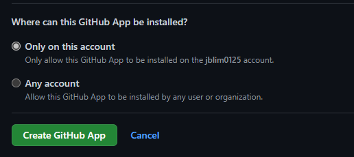  
9. 화면 상단의 버튼(generate a private key) 클릭하여 다음 섹션'인증키 생성' 과정 1-3을 생략할 수 있다. 
    

### 1.2. 인증키 생성 : Generating A Private Key For Auth  
1. 프로파일 아이콘 > 설정(Settings)  
      
2. 왼쪽 창 : Developer Settings > GitHub Apps  
      
3. Create GitHub App 과정에서 생성한 App 옆의 Edit 클릭   
      
4. Generate a private key를 선택   
    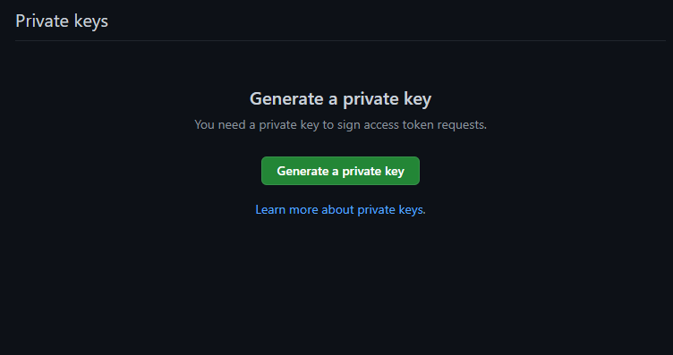  
5. 키 변환(for jenkins)  
    generate a private key 선택 시 파일을 다운로드 함.
    이 파일을 잘 보관하자.
    이 파일을 openssl 명령을 이용해 변환한다.(openssl 커맨드 설치 필요)  
    ```shell
    $ openssl pkcs8 -topk8 -inform PEM -outform PEM -in key-in-your-downloads-folder.pem -out github-app.pem -nocrypt
    ```
### 1.3. 사용 설정 : Install  
1. 프로파일 아이콘 > 설정(Settings)  
      
2. 왼쪽 창 : Developer Settings > GitHub Apps  
      
3. Create GitHub App 과정에서 생성한 App 옆의 Edit 클릭   
    
4. Install App 선택  
    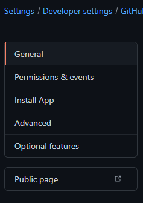  
5. 설치할 곳 선택  
        
6. 연동할 저장소 선택  
   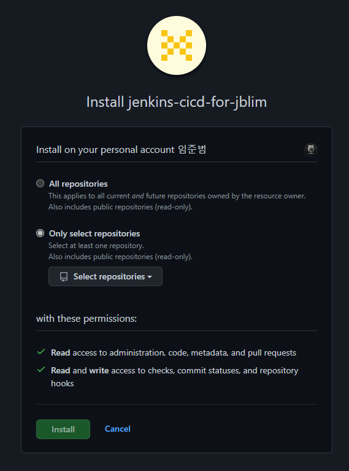  

### 1.4. 인증(계정) 추가 : In Jenkins  
**준비물**  
1. GitHub App About 정보 기록  
    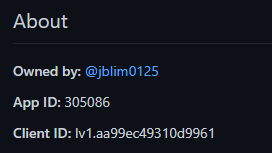  
2. 인증 키  
    openssl을 이용해 변환한 키 데이터  
    ```shell
    $ cat github-app.pem
    ```

**젠킨스 접속**  
1. Jenkins 관리 > Security > Manage Credentials  
      
2. 화면 상에서 (global) 클릭  
    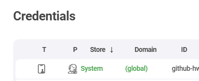  
3. 우측 상단의 Add Credentials 선택  
    * Kind : GitHubApp  
    * ID : 젠킨스에서 사용할 인증 이름(ex : github app name('-' 사용불가))
    * Desc : 설명  
    * App ID : GitHub App About - App ID  
    * Key : openssl 을 이용해 변환한 키 데이터  
        ```shell
        $ cat converted-github-app.pem
        ```
4. Test Connection 후 Create

## 2. Jenkins(Project, Pipeline, JenkinsFile)  
이 장에서는 [GitHub Flow 개발 전략](###-1.2.-Github-flow-전략)에 따라 일일 빌드와 배포를 위한 
Jenkins Project(Item) 생성과 Pipeline 설정에 대해서 설명한다.  

### 2.1. Create Project

1. 새로운 Item  
    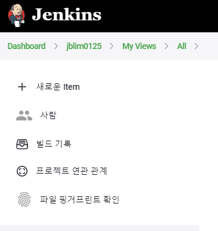  
2. 이름을 입력, Multibranch Pipeline 선택 > OK  
    레퍼런스가 있는 경우 'Copy from' 을 이용 ( 이 부분은 나중에 작성 )   
    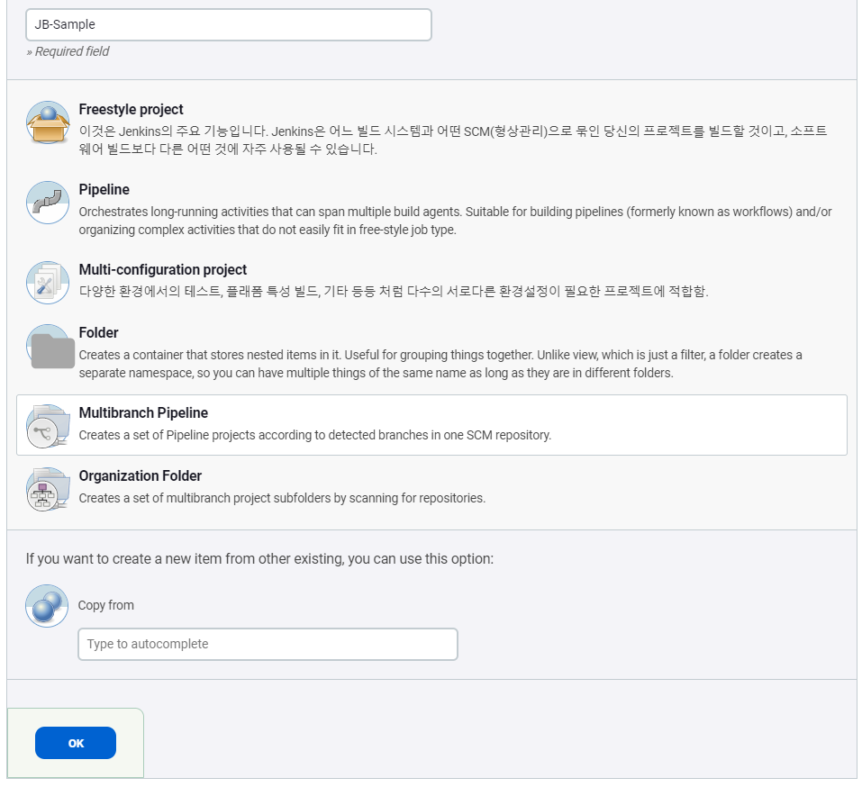  
3. Name, Description 입력  
4. Branch Sources > GitHub 선택   
    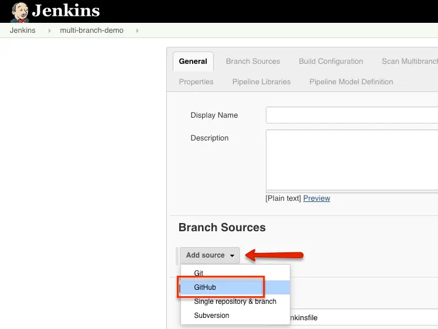  
5. Credentials > 이 전 단계에서 추가한 인증(ex : JB CI/CD )  
6. Repository HTTPS URL > CI/CD를 구성 할 github 저장소 
    주의 : GitHub App과 Repository가 연결되어 있어야 한다.  
    [참조. GitHub App과 Repository 연결](##-Appendix-1.-GitHub-App-과-Repository-연결)
7. Behaviours 의 선택  
    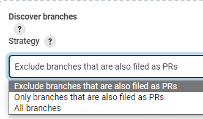  
    * Exclude branches that are also filed as PRs  
       PR 후 PR을 한 브랜치를 제외(PR 후 변화가 없는 브랜치를 Disable 상태로 처리)  
    * Only branches that are also filed as PRs  
       PR이 없는 브랜치에 대해서 커밋이 발생하더라도 처리하지 않음.  
       일일 커밋과 빌드와는 맞지 않음.  
    * All branches 
8. Submodule 설정  
    패스  
      
9. 빌드 기록 관리  
    * 기능을 활성화 하는 경우 기본적으로 브랜치 삭제 시 젠킨스 기록도 함께 삭제  
    * 브랜치 삭제에 상관없이 빌드 기록을 볼 수 있도록 보관 규칙(보관일과 최대 보관 수)을 설정  
    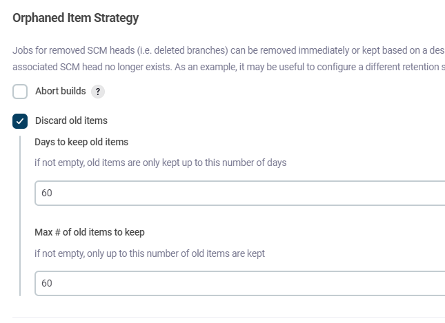  
10. 기타...
    패스  
11. 생성  
    !!참고. 저장소에 Jenkinsfile이 없거나, 아무 것도 없다면 save 후 동작하지 않는다.  

## 3. 실습 : Spring Boot + Vue.JS Project
* 환경
  * Spring Boot(Maven)
  * Node.JS(Vue.js)
  * Dockerfile(Cache Enable)  

1. 저장소 생성  
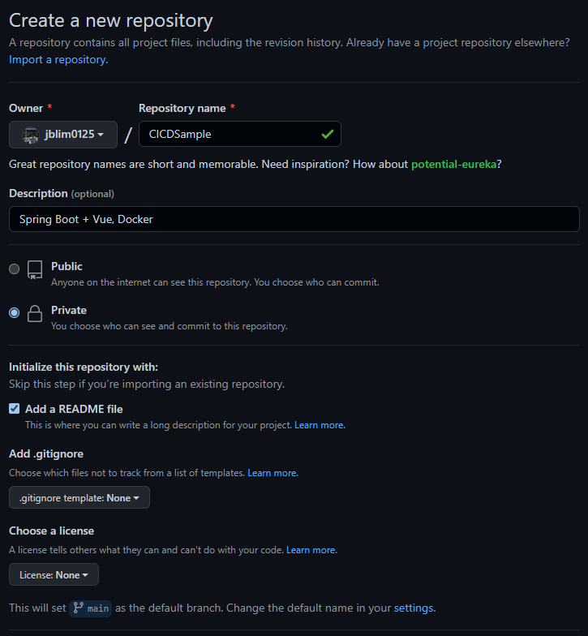  
2. App 연결  
profile > settings > application > app(configure) > Repository Access > New Repository  
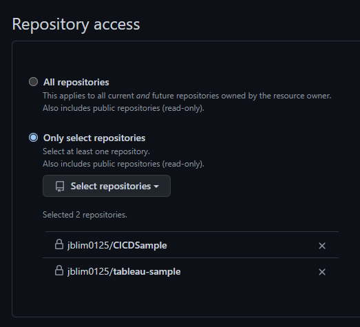  

3. Dockerfile
   
4. Jenkinsfile

## Appendix 1. GitHub App 과 Repository 연결  
1. 프로파일 아이콘 > 설정(Settings)  
     
2. 왼쪽창에서 Application 선택  
      
3. App 우측의 Configure 선택  
      
4. Repository 추가 > Save  
