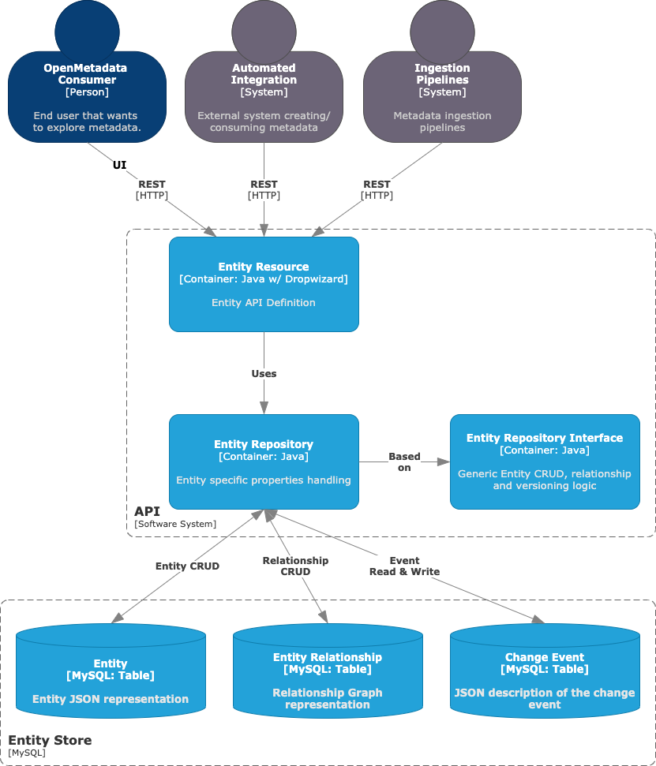

# Open Metadata Study

## Arch

### System Context  

- API Server  
    오픈메타데이터의 주요 프로세스. 메타데이터 엔티티와 상호 작용할 수 있는 방법을 정의.  
- UI  
    사용자가 모든 데이터 자산을 추적하는데 도움이 되는 Discovery 중심 도구.  
    사용자 간 협력과 가능하게 하고 연료를 공급하는 것이다.  
- 수집 프레임워크  
    이 시스템은 모든 커넥터의 기초. 즉, OpenMetadata와 우리가 통합하려는 메타데이터를 포함하는 외부 시스템 간의 상호 작용을 정의하는 구성 요소.  
- Entity Store  
    모든 엔티티의 상태와 관계에 대한 실시간 정보가 포함된 MySQL/PostgreSQL 스토리지.
- Search Engine  
    ElasticSearch에 의해 구동되는 이 시스템은 사용자가 메타데이터를 발견하는데 도움이 되는 UI의 인덱싱 시스템입니다.

### JSON Schema

Open Metadata 의 주요 3가지 구성 요소들은 통일된 구조의 메시지를 이용해 통신하고 동작한다.  
JSON Schema 를 이용해 UI(TypeScript), API Server(Java), Ingestion(Python) 각 구성요소들에서 동작한다.  

### API Server

사용자 요청(UI) 및 메타데이터 수집 프레임워크를 포함한 내,외부 통신 처리  
메타데이터 상태 업데이트

## Ingestion

## 